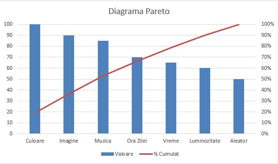

# L.E.D.++

## Scopul aplicatiei

Aplicația are ca scop iluminarea ambientală folosind diferite input-uri, cum ar fi vremea de afară, muzică, luminozitatea, vectori de pixeli, sau preferențele utilizatorului.

Pentru a-si atinge scopurile, aplicația foloseste LED-uri “smart”. Utilitatea LED-urilor “smart” are impact in calitatea vieții utilizatorului, protejarea vederii acestuia (prin crearea unui contrast cu lumina monitorului) si crearea unei atmosfere aparte in camera.

## Aria de acoperire a aplicatiei

Aplicația se diferențiază față de competitori datorită nivelului avansat de customizare și integrare pe care aceasta îl oferă. Astfel, cu sistemul nostru inteligent de LED-uri programabile, putem prelua input-uri din mai multe medii și prin mai multe device-uri IoT asociate. În integrarea actuală, admitem programarea secvențelor de LED-uri în mod manual de către utilizatori, precum și schimbarea acestora în funcție de vremea de afară, luminozitatea din cameră, input-uri de la device-uri IoT ce fac redare muzicală precum și preluarea matricei de pixeli direct dintr-un device ce rulează un sistem de operare popular (telefoane: Android, iPhone, Windows Phone, precum și sisteme de operare pentru PC-uri: Unix (MacOS, Linux, etc.), Windows). 

Aplicația noastră îmbunătățește calitatea vieții utilizatorului prin prisma faptului că aceasta folosește un sistem selectiv de prioritizare a input-urilor, întrucât sistemul nostru inteligent de LED-uri ia în calcul mai mulți factori (vremea, luminozitatea din cameră, ambientul sonor, etc.) pentru a maximiza confortul utilizatorilor.

## Grupurile de interese

Demografica principală interesată de aplicație este compusă din persoane care petrec mult timp in fața calculatorului. Grupul țintă este compus din gameri, streameri si alți oameni care au nevoie de o atmosferă ambientală pe parcursul sesiunilor lungi la calculator. Ochii utilizatorilor pot suferi deteriorări in timp iar acest produs poate conserva starea lor prin filtrarea contrastelor de lumină in funcție de situație.

## Prioritizarea cerintelor

Vom prezenta pe scurt Analiza Pareto, reprezentată de scorul pentru dificultate si scorul de valoare, pentru fiecare cerință:
- setare culoare 10 dificultate, 100 valoare, 
- setare in funcție de muzică 80 dificultate, 85 valoare
- în funcție de imagine 80 dificultate, 90 valoare
- în funcție de luminozitate 40 dificultate, 60 valoare
- în funcție de ora zilei 30 dificultate, 70 valoare
- culoare aleatoare 20 dificultate, 50 valoare
- în funcție de vreme 50 dificultate, 65 valoare

Conform Analizei Pareto aplicată pe impact și efort, am decis ca în proiect vom implementa cerințele în următoarea ordine: setarea culorii, setarea în funcție de imagine, setarea in funcție de muzică, setarea în funcție de ora zilei, setarea în funcție de vreme, setarea în funcție de luminozitate și setarea culorii în mod aleator.




## Dependencies

Install apt packages with the versioning provided in `system_requirements.MD`

Install Mosquitto

```sh
sudo apt-add-repository ppa:mosquitto-dev/mosquitto-ppa
sudo apt update
sudo apt install mosquitto
```

Install Paho

```sh
sudo apt-get install build-essential gcc make cmake cmake-gui cmake-curses-gui
sudo apt-get install libssl-dev


git clone https://github.com/eclipse/paho.mqtt.c.git
cd paho.mqtt.c
git checkout v1.3.8
cmake -Bbuild -H. -DPAHO_ENABLE_TESTING=OFF -DPAHO_BUILD_STATIC=ON \
    -DPAHO_WITH_SSL=ON -DPAHO_HIGH_PERFORMANCE=ON
sudo cmake --build build/ --target install
sudo ldconfig


git clone https://github.com/eclipse/paho.mqtt.cpp
cd paho.mqtt.cpp
cmake -Bbuild -H. -DPAHO_BUILD_STATIC=ON \
    -DPAHO_BUILD_DOCUMENTATION=TRUE -DPAHO_BUILD_SAMPLES=TRUE
sudo cmake --build build/ --target install
sudo ldconfig
```

## MQTT Server

Run `mosquitto -v` in terminal

## MQTT Publisher

Build `mqtt_publisher.cpp` and run it to send a JSON message to MQTT Server

## Building

Build by executing build.sh on Linux (Debian/Ubuntu/CentOS RHEL), run `doxygen Doxyfile` to regenerate documentation

## Better visuals, better documentation

For better visuals, install `hugo` and run `./doxybook2 --input xml/ --output doxybook_output/documentation/content --config .doxybook/config.json --templates .doxybook/templates/`.
The, navigate to documentation using `cd doxybook_output/documentation` and run `hugo serve`.

## Running

Run `mosquitto -v` in terminal.
After building with build.sh, run /build/main. This will open HTTP (port 8080) and MQTT (port 1883, topic "LED") input buffers.
You can modify `mqtt_publisher.cpp` to publish different JSONs to the client, or use any other MQTT Client to publish messages to topic "LED".
You can send JSONs through CURL that match the regex in the documentation to change LED state.
